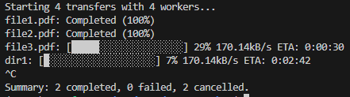

# rsync_python

## Overview

`rsync_python` is a Python tool that wraps the powerful `rsync` Linux command to transfer files and folders efficiently. It leverages multithreading and subprocesses to run multiple transfers in parallel, displaying aligned progress bars in the terminal.

## Features

- Transfers files and folders using `rsync` subprocesses
- Displays real-time, aligned progress for multiple concurrent transfers
- Calculates optimal number of worker threads based on system CPU, memory, and storage type
- Simple and readable Python codebase
- Command-line interface for easy usage
- Linux based logic

## Installation

1. Clone the repository [LINK](https://github.com/MaorGrab/rsync_python)
2. In the cloned repository run: `pip install -e .`

## Usage

Basic usage example:

```bash
python -m rsync_python /path/to/src1 /path/to/src2 /path/to/destination
```

Options:

- `--parallel`: Number of parallel transfers (default: set autmatically based on system specs)
- `--partial`: Save partial files if interrupted, allowing faster recovery

## Project Structure

```
rsync_python/
├── pyproject.toml
├── docs/
│   └── README.md
└── rsync_python/
    ├── __main__.py
    ├── core/
    │   ├── transfer_manager.py
    │   ├── display_manager.py
    │   └── transfer.py
    ├── cli/
    │   └── parse_args.py
    ├── utils/
    │   ├── shutdown_handler.py
    │   ├── progress.py
    │   ├── optimal_worker_count.py
    │   └── transfer_status.py
    └── configurations/
        └── constants.py
```

- `__main__.py`: Entry point for the CLI
- `core/`: Core logic for managing transfers and display
- `cli/`: Command-line argument parsing
- `utils/`: Utility modules including graceful shutdown, progress tracking, worker count calculation, and status enums
- `configurations/`: Project-wide constants

## How It Works

1. The CLI parses arguments and determines source(s) and destination paths.
2. The `optimal_worker_count.py` module calculates the recommended number of concurrent workers based on system CPU cores, memory, and storage type.
3. The `transfer_manager.py` manages multiple `Transfer` instances, each wrapping an `rsync` subprocess.
4. The `display_manager.py` updates the terminal with aligned progress bars for each transfer.
5. Graceful shutdown is handled via `shutdown_handler.py`.

## Run Examples
### Run console output example


### Basic File Transfer

Transfer a single folder to a destination:

```bash
python -m rsync_python /path/to/source_folder_or_file /path/to/destination_folder
```

### Multiple Sources

Transfer multiple files or folders to a destination:

```bash
python -m rsync_python /path/to/file1 /path/to/folder2 /path/to/destination
```

### Set Number of Parallel Transfers

Specify the number of concurrent transfers (threads):

```bash
python -m rsync_python /src/file1.txt /src/dirA /dst/ --parallel 4 
```

If `--parallel` is not set or is `0`, the tool automatically chooses an optimal worker count based on your system.

### Save Partial Files

Keep partially transferred files if a transfer is interrupted:

```bash
python -m rsync_python /src/file1.txt /src/dirA /dst/ --partial
```

### Limit transfer bandwidth

Limit the transfer bandwidth in KB/s:

```bash
python -m rsync_python /src/file1.txt /src/dirA /dst/ --bwlimit 200
```

### Combine Options

Use multiple options together:

```bash
python -m rsync_python /src/file1.txt /src/dirA /dst/ --parallel 8 --partial --bwlimit 200
```

### Graceful Shutdown

Press `Ctrl+C` during execution to gracefully stop all transfers. The tool will display a summary of completed, failed, and cancelled transfers.

---

**Tip:**  
- All progress is displayed in real-time, with each transfer shown on its own line.
- The summary at the end shows how many transfers completed, failed, or were cancelled.

---

## Project Metadata
- Author: Maor Grab (maor.grab@gmail.com)
- License: MIT License
- Repository: https://github.com/MaorGrab/rsync_python

## License

This project is licensed under the MIT License. See the LICENSE file for details.

## Contact

For questions or contributions, please contact the author.